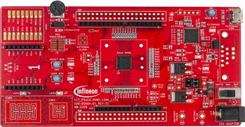
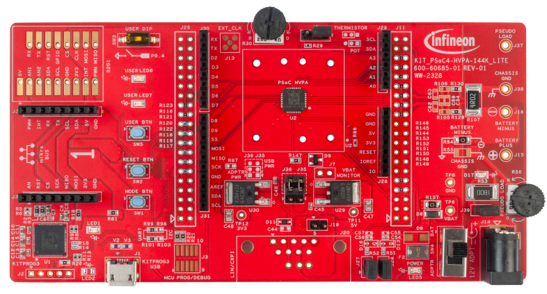

# PSOC&#8482; 4 HV ModusToolbox&#8482;
PSOC&#8482; 4 HV series is available with ModusToolbox&#8482;. Code example is made up of two parts: the default code examples and the additional code examples.

The additional code examples are available for PSOC&#8482; 4 HV devices in this repository.

Please refer the [ModusToolbox&#8482; software](https://github.com/Infineon/modustoolbox-software) for ModusToolbox&#8482;. It is recommended using latest ModusToolbox&#8482; software.

## Supported device and BSP
[PSOC&#8482; 4 HVMS MCU](https://www.infineon.com/products/microcontroller/32-bit-psoc-arm-cortex/psoc-4-hv-m0/hv-ms): CY8C4146LWE-HVS115X, CY8C4147LWE-HVS135X, CY8C4146LWE-HVS015X, CY8C4147LWE-HVS035X

|BSP name|KIT_PSOC4-HVMS-64K_LITE|KIT_PSOC4-HVMS-128K_LITE|KIT_PSOC4-HVMS-64K_LITE-02|KIT_PSOC4-HVMS-128K_LITE-02|
|-----------|---------------------|---------------------|-------------------|-------------------|
|Support Device|CY8C4146LWE-HVS115X  |CY8C4147LWE-HVS135X  |CY8C4146LWE-HVS015X|CY8C4147LWE-HVS035X|

[PSOC&#8482; 4 HVPA MCU](https://www.infineon.com/products/microcontroller/32-bit-psoc-arm-cortex/psoc-4-hv-m0/hv-pa): CY8C4147LCE-HV423

|BSP name|KIT_PSOC4-HVPA-144K_LITE
|-----------|---------------------
|Support Device|CY8C4147LCE-HV423

**Note:** Please select the appropriate BSP in the project creator according to device implemented on your LITE kit.

## Application note
[AN0034](https://www.infineon.com/assets/row/public/documents/10/42/infineon-an0034-getting-started-with-psoc-4-hv-ms-mcus-in-modustoolbox-applicationnotes-en.pdf) - Getting started with PSOC&#8482; 4 HV MCUs in ModusToolbox&#8482;

## Code Example
Each Code example provides a README.md file to learn more about that code example, as well as how to use it to create an application.

## How to apply ModusToolbox&#8482; to your own hardware
All ModusToolbox&#8482; applications require a target BSP. Infineon provides BSPs for all of our kits, as well as generic BSPs for each chip architecture, to use as a starting point. For example, you can see generic BSPs in supported device. When working with your own hardware, you can modify an Infineon BSP to match that hardware, or you can create a BSP by specifying the device(s) it contains. The BSP Assistant helps to simplify the process of creating or modifying a BSP to suit your needs. See the following document how to use BSP Assistant tool. 

- [ModusToolbox&#8482; BSP Assistant user guide](https://www.infineon.com/ModusToolboxBSPAssistant)
- [MODUSTOOLBOX&#8482; USAGE: How to create own BSP using BSP-assistant tool for TRAVEO T2G/PSOC 4 HV](https://www.infineon.com/assets/row/public/documents/10/56/infineon-infineon-002-36696-0a-v-how-to-create-own-bsp-using-bsp-assistant-tool-training-en-training-en.pdf)

## Evaluation kit
The code examples support the following types of boards:  
*Figure 1. KIT_PSoC4-HVMS-64K_LITE*  
*Figure 2. KIT_PSoC4-HVMS-128K_LITE*  
*Figure 3. KIT_PSoC4-HVPA-144K_LITE*  

|   Overview|[KIT_PSoC4-HVMS-64K_LITE](https://www.infineon.com/cms/en/product/evaluation-boards/kit_psoc4-hvms-64k_lite/)  |[KIT_PSoC4-HVMS-128K_LITE](https://www.infineon.com/cms/en/product/evaluation-boards/kit_psoc4-hvms-128k_lite/)  |[KIT_PSOC4-HVPA-144K_LITE](https://www.infineon.com/evaluation-board/KIT-PSOC4-HVPA-144K-LITE)
|-------------------------------    |-------------------------|--------------------------|-------------------------|
|MCU                                |CY8C4146LWE-HVS015X      |CY8C4147LWE-HVS035X       |CY8C4147LCE-HV423        |
|Package                            |56pin-QFN                |56pin-QFN                 | 32pin-QFN               |
|Kitprog3 programming/Debug         |✓ (USB Micro-B connector)|✓ (USB Micro-B connector)|✓ (USB Micro-B connector)|
|USER LEDs/Buttons/Potentiometer    |✓                        |✓                        |✓                        |
|Temperature sensor                 |✓                        |✓                        |✓                        |
|Pseudo load for wall adapter       |N/A                      |N/A                       |✓                        |
|Pseudo load for battery connector  |N/A                      |N/A                       |✓                        |
|LIN/CXPI connector                 |✓                        |✓                        |✓ *1                     |
|CAPSENSE&trade; Button/LED         |✓                        |✓                        |N/A                      |
|Arduino                            |✓                        |✓                        |✓                        |
|Shield2go                          |✓                        |✓                        |✓                        |
|MikroBUS                           |✓                        |✓                        |✓                        |

*1: KIT_PSOC4-HVPA-144K_LITE supports LIN slave configuration only
 

## Developer Community
For questions and support, use the PSOC&trade; 4 HVMS Forum:  
- <https://community.infineon.com/t5/PSOC-Automotive/bd-p/psocautomotive>

