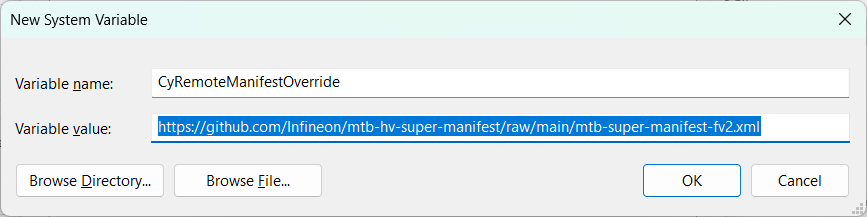
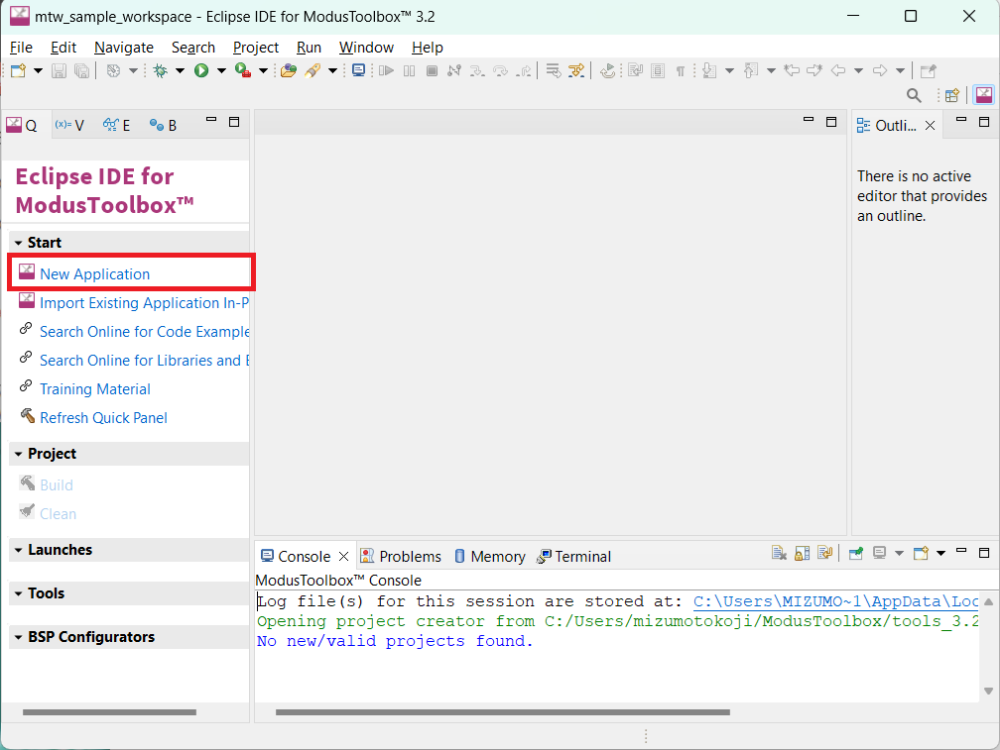
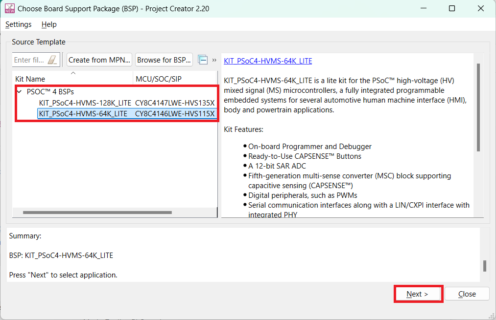
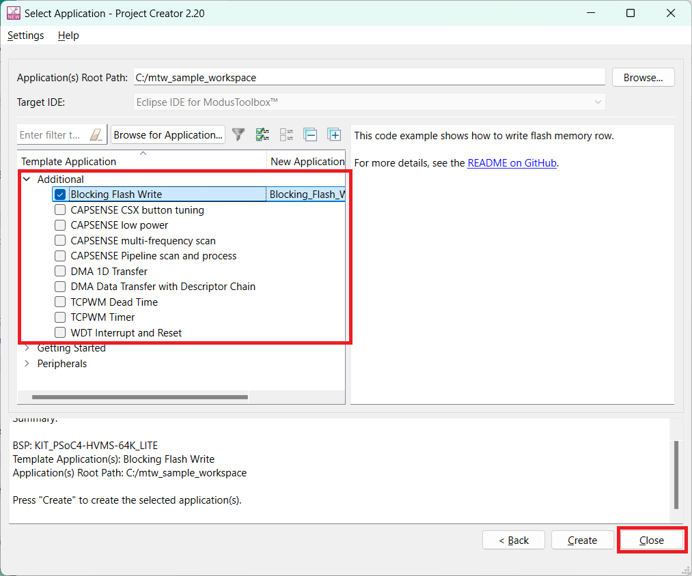

# PSOC&trade; 4 HV ModusToolbox™
PSOC&trade; 4 HV series is available with ModusToolbox™.
series code example is made up of two parts: the default code examples and the additional code examples.
The additional code examples are available for PSOC&trade; 4 HV devices in this repository.

To use a code example into ModusToolbox™, follow the guide at **[How to setup](#How-to-setup)**.

Please refer the [ModusToolbox™ software](https://github.com/Infineon/modustoolbox-software) for ModusToolbox™. It is recommended using latest ModusToolbox™ software.

## Supported device
[PSOC&trade; 4 HVMS MCU](https://www.infineon.com/cms/en/product/microcontroller/32-bit-psoc-arm-cortex-microcontroller/32-bit-psoc-4-hv-arm-cortex-m0/): CY8C4146LWE-HVS115X, CY8C4147LWE-HVS135X

## Application note
AN0034 - Getting started with PSOC&trade; 4 HVMS MCUs in ModusToolbox&trade;

## Code Example
Each Code example provides a README.md file to learn more about that code example, as well as how to use it to create an application. Each README.md contains the following information:

- **Device**: The devices used by code example
- **Board**: The evaluation kit used by code example
- **Scope of work**: An abstract of code example
- **Introduction**: A generic introduction on the used module and it main features
- **Hardware setup**: The used hardware and how to configure it
- **Implementation**: A detailed explanation of how to implement the module's configuration using HAL and/or PDL and exploits their features
- **Run and Test**: The steps to follow to make sure the code is working properly and interact with it
- **References**: Related documents and web pages

[PSOC&trade; 4 HV MCU Code examples](https://github.com/orgs/Infineon/repositories?language=&q=mtb-hv&sort=&type=all) on GitHub

## How to setup
To use the additional code examples, set the following environment variable on your PC.  
**Before perform this process, Modus toolbox should be closed if you run Modus toolbox.**

- Variable name = CyRemoteManifestOverride
- Variable value = https://github.com/Infineon/mtb-t2g-super-manifest/raw/main/mtb-super-manifest-fv2.xml

*Figure 1. System variable setting* 

From the menu, run the Eclipse IDE of ModusToolbox™ application. Then, open the Eclipse IDE window after workspace location setting.
- Click the **New Application** of Start in the Quick Panel, after that, open the Project creator.

*Figure 2. ModusToolbox™ Eclipse IDE* 

- Select the Board support package (BSP) what want to use, and click the **Next>** button.

*Figure 3. Project Creator* 

- Open the Select application window. You can choose and use **Additional Code Examples** and **Advanced Solutions** for TRAVEO™ T2G.

*Figure 4. Select application* 

## Evaluation kit
The code examples support the following types of boards:  
*Figure 5. KIT_PSoC4-HVMS-64K_LITE*  
*Figure 6. KIT_PSoC4-HVMS-128K_LITE*  

|   Overview|[KIT_PSoC4-HVMS-64K_LITE](https://www.infineon.com/cms/en/product/evaluation-boards/kit_psoc4-hvms-64k_lite/)  |[KIT_PSoC4-HVMS-128K_LITE](https://www.infineon.com/cms/en/product/evaluation-boards/kit_psoc4-hvms-128k_lite/)  |
|-------------------------------|------------------------|--------------------------|
|MCU                            |CY8C4146LWE-HVS115X (56pin-QFN) |CY8C4147LWE-HVS135X (56pin-QFN) |
|Kitprog3 programming/Debug     |✓ (USB Micro-B connector)|✓ (USB Micro-B connector)|
|USER LEDs/Buttons/Potentiometer|✓                       |✓                        |
|Temperature sensor             |✓                       |✓                        |
|LIN/CXPI connector             |✓                       |✓                        |
|CAPSENSE&trade; Button/LED     |✓                       |✓                        |
|Arduino                        |✓                       |✓                        |
|Shield2go                      |✓                       |✓                        |
|MikroBUS                       |✓                       |✓                        |
 